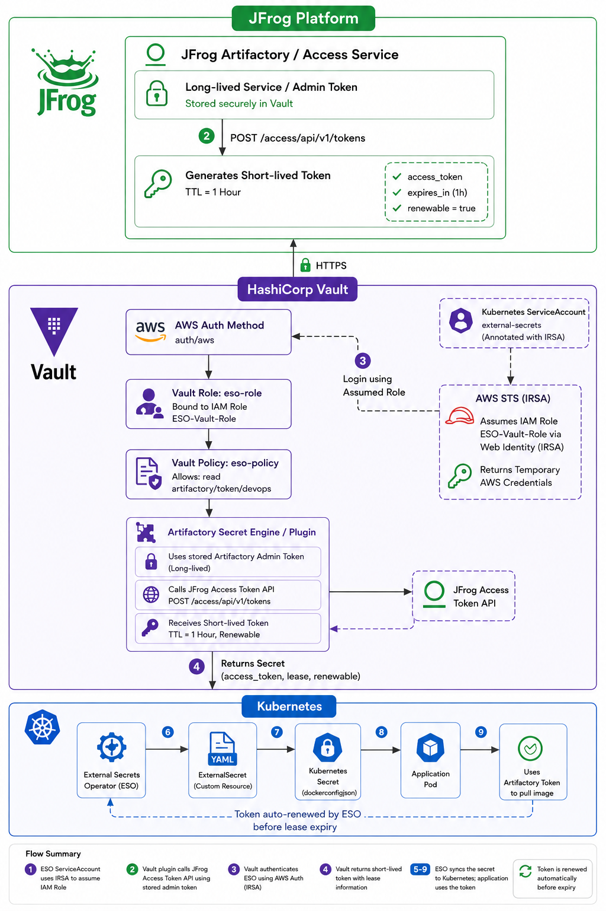

# Integrating HashiCorp Vault Artifactory Secrets Plugin with External Secrets Operator (ESO)

This guide demonstrates how to integrate **HashiCorp Vault**, the **JFrog Artifactory Secrets Plugin**, and **External Secrets Operator (ESO)** to securely generate **dynamic short-lived Artifactory access tokens** and create a Kubernetes Docker registry secret.

Instead of storing long-lived Artifactory credentials in Kubernetes, Vault generates a fresh access token whenever External Secrets Operator requests one.

---

# Architecture

```text
                                        AWS Account
+------------------------------------------------------------------------+
|                                                                        |
| IAM Role: ESO-Vault-Role                                               |
| Trust Relationship: EKS OIDC Provider (IRSA)                           |
|                                                                        |
+----------------------------------+-------------------------------------+
                                   ^
                                   | AssumeRoleWithWebIdentity
                                   |
                        AWS STS Issues Temporary Credentials
                                   |
+------------------------------------------------------------------------+
|                           Amazon EKS Cluster                           |
|                                                                        |
| Namespace: external-secrets                                            |
|                                                                        |
| +---------------------------------------------------------------+      |
| | External Secrets Operator                                    |      |
| |---------------------------------------------------------------|      |
| | ServiceAccount: external-secrets                             |      |
| | IAM Role: ESO-Vault-Role (IRSA)                              |      |
| +-----------------------------+---------------------------------+      |
|                               |                                        |
|                               | AWS IAM Authentication                 |
|                               ▼                                        |
+-------------------------------|----------------------------------------+
                                |
                                ▼
                    +-------------------------------+
                    |       HashiCorp Vault         |
                    |-------------------------------|
                    | auth/aws                      |
                    | Vault Role: eso-role          |
                    | Vault Policy: eso-policy      |
                    |                               |
                    | Artifactory Secrets Plugin    |
                    | Path: artifactory/            |
                    +---------------+---------------+
                                    |
                                    | Uses stored Admin Token
                                    ▼
                         +------------------------+
                         |      Artifactory       |
                         |------------------------|
                         | Creates Short-lived    |
                         | Access Token           |
                         +------------+-----------+
                                      |
                                      ▼
                           Returns Dynamic Token
                                      |
                                      ▼
+------------------------------------------------------------------------+
|                          Amazon EKS Cluster                            |
|                                                                        |
| Kubernetes Secret                                                      |
| Type: kubernetes.io/dockerconfigjson                                   |
|                                                                        |
| Contains Dynamic Artifactory Access Token                              |
|                                                                        |
+-----------------------------------+------------------------------------+
                                    |
                                    ▼
                           Kubernetes Deployment
                                    |
                                    ▼
                    Pull Docker Images from Artifactory
```

---

# Authentication Flow

```text
1. ESO Pod Starts
        │
        ▼
2. ServiceAccount (external-secrets)
        │
        ▼
3. IRSA assumes IAM Role (ESO-Vault-Role)
        │
        ▼
4. AWS STS issues temporary AWS credentials
        │
        ▼
5. ESO authenticates to Vault using auth/aws
        │
        ▼
6. Vault validates the IAM Role
        │
        ▼
7. Vault maps IAM Role → Vault Role (eso-role)
        │
        ▼
8. Vault attaches Vault Policy (eso-policy)
        │
        ▼
9. ESO requests:
      artifactory/token/devops
        │
        ▼
10. Vault Artifactory Plugin
        │
        ▼
11. Plugin authenticates to Artifactory using Admin Token
        │
        ▼
12. Artifactory generates a short-lived Access Token
        │
        ▼
13. Vault returns the token to ESO
        │
        ▼
14. ESO creates/updates Kubernetes Docker Registry Secret
        │
        ▼
15. Kubernetes Deployment pulls Docker image from Artifactory
```


---

# Prerequisites

- Amazon EKS Cluster
- HashiCorp Vault
- Vault AWS Authentication enabled
- JFrog Artifactory
- JFrog Artifactory Vault Plugin installed
- External Secrets Operator
- IAM Role for Service Account (IRSA)
- Docker Local Repository in Artifactory

---

# Step 1: Register the Artifactory Plugin

```bash
vault plugin register \
    -sha256=<PLUGIN_SHA256> \
    secret \
    artifactory
```

Enable the plugin.

```bash
vault secrets enable \
    -path=artifactory \
    -plugin-name=artifactory \
    plugin
```

---

# Step 2: Configure Artifactory

Configure the plugin with the Artifactory administrator access token.

```bash
vault write artifactory/config/admin \
    url="https://artifactory.example.com/artifactory" \
    access_token="<ARTIFACTORY_ADMIN_ACCESS_TOKEN>"
```

---

# Step 3: Create Vault Policy

```bash
vault policy write eso-policy - <<EOF
path "artifactory/token/devops" {
  capabilities = ["read"]
}
EOF
```

Verify the policy.

```bash
vault policy read eso-policy
```

---

# Step 4: Create Vault AWS Role

```bash
vault write auth/aws/role/eso-role \
    auth_type=iam \
    bound_iam_principal_arn="arn:aws:iam::<ACCOUNT_ID>:role/ESO-Vault-Role" \
    policies="eso-policy" \
    ttl="1h"
```

Verify the role.

```bash
vault read auth/aws/role/eso-role
```

---

# Step 5: Create Artifactory Role

Example:

```bash
vault write artifactory/roles/devops \
    username="build-user" \
    expires_in="1h"
```

This role determines how Vault generates dynamic Artifactory access tokens.

---

# Step 6: Deploy SecretStore

```bash
kubectl apply -f secretstore.yaml
```

Verify.

```bash
kubectl get secretstore
```

---

# Step 7: Deploy ExternalSecret

```bash
kubectl apply -f externalsecret.yaml
```

Verify.

```bash
kubectl get externalsecret
```

---

# Step 8: Verify Kubernetes Secret

```bash
kubectl get secret
```

Describe the generated secret.

```bash
kubectl describe secret artifactory-docker-secret
```

---

# Step 9: Deploy Application

Example Deployment.

```yaml
apiVersion: apps/v1
kind: Deployment
metadata:
  name: nginx
spec:
  replicas: 1
  selector:
    matchLabels:
      app: nginx

  template:
    metadata:
      labels:
        app: nginx

    spec:
      imagePullSecrets:
      - name: artifactory-docker-secret

      containers:
      - name: nginx
        image: artifactory.example.com/docker-local/nginx:v1
        imagePullPolicy: Always
```

Deploy.

```bash
kubectl apply -f deployment.yaml
```

---

# Validation

Verify that ESO has synchronized the secret.

```bash
kubectl describe externalsecret artifactory-token
```

Verify the Kubernetes secret.

```bash
kubectl get secret artifactory-docker-secret
```

Verify the pod.

```bash
kubectl get pods
```

Describe the pod.

```bash
kubectl describe pod <pod-name>
```

Expected Event:

```text
Successfully pulled image "artifactory.example.com/docker-local/nginx:v1"
```

---

# End-to-End Flow

```text
Developer
    │
    ▼
Push Docker Image
    │
    ▼
Artifactory Docker Repository
    │
    ▼
Vault Artifactory Plugin
    │
Generates Dynamic Token
    │
    ▼
External Secrets Operator
    │
Creates Docker Registry Secret
    │
    ▼
Kubernetes Deployment
    │
Pulls Docker Image
    ▼
Application Running
```

---

# Benefits

- No long-lived Artifactory credentials stored in Kubernetes.
- Automatic generation of short-lived Artifactory access tokens.
- Automatic token rotation through External Secrets Operator.
- IAM-based authentication to Vault using IRSA.
- Centralized secrets management with HashiCorp Vault.
- Secure image pulls from Artifactory using dynamically generated credentials.