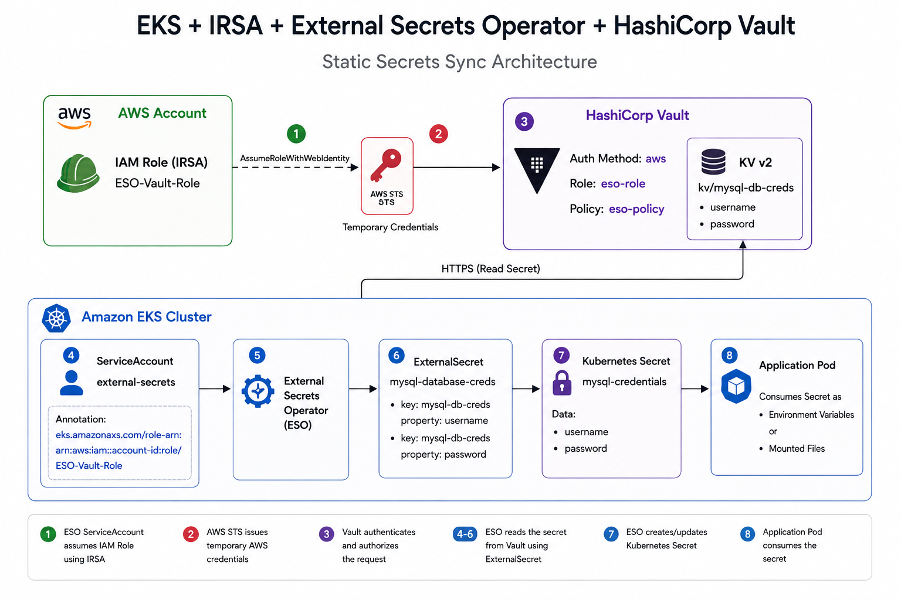

# Integrating HashiCorp Vault with External Secrets Operator (ESO)

This guide demonstrates how to configure HashiCorp Vault with Kubernetes authentication so that External Secrets Operator (ESO) can securely retrieve an Artifactory token from Vault and create a Kubernetes Docker registry secret.

---

# Architecture

```
                              AWS Account
+-------------------------------------------------------------------+
|                                                                   |
|  IAM Role: ESO-Vault-Role                                         |
|  Trust: EKS OIDC Provider                                         |
|                                                                   |
+--------------------------+----------------------------------------+
                           ^
                           | AssumeRoleWithWebIdentity (IRSA)
                           |
                    AWS STS Issues Temporary Credentials
                           |
+-------------------------------------------------------------------+
|                         Amazon EKS Cluster                        |
|                                                                   |
|  Namespace: argocd                                                |
|                                                                   |
|  +-----------------------------------------------------------+    |
|  | External Secrets Operator                                |    |
|  |-----------------------------------------------------------|    |
|  | ServiceAccount: external-secrets                         |    |
|  | Annotation:                                              |    |
|  | eks.amazonaws.com/role-arn = ESO-Vault-Role             |    |
|  +---------------------------+-------------------------------+    |
|                              |                                    |
|                              | AWS IAM Login                      |
|                              v                                    |
+------------------------------|------------------------------------+
                               |
                               v
                  +-----------------------------+
                  |     HashiCorp Vault         |
                  |-----------------------------|
                  | AWS Auth Method (auth/aws)  |
                  | Vault Role: eso-role        |
                  | Vault Policy: eso-policy    |
                  |                             |
                  | KV Secrets Engine           |
                  | kv/mysql-db-creds           |
                  | username                    |
                  | password                    |
                  +--------------+--------------+
                                 |
                                 | Read Secret
                                 |
                                 v
+-------------------------------------------------------------------+
|                         Amazon EKS Cluster                        |
|                                                                   |
| Kubernetes Secret                                                 |
| Name: mysql-credentials                                           |
|                                                                   |
| username=dbuser                                                   |
| password=******                                                   |
|                                                                   |
+-----------------------------+-------------------------------------+
                              |
                              |
                              v
                     Application Deployment
                     -----------------------
                     env:
                       DB_USERNAME
                       DB_PASSWORD
```

# Authentication Flow

```
1. ESO Pod Starts
        │
        ▼
2. ServiceAccount (external-secrets)
        │
        ▼
3. IRSA assumes IAM Role (ESO-Vault-Role)
        │
        ▼
4. AWS STS returns temporary credentials
        │
        ▼
5. ESO logs into Vault using auth/aws
        │
        ▼
6. Vault verifies IAM Role
        │
        ▼
7. Vault maps IAM Role → Vault Role (eso-role)
        │
        ▼
8. Vault attaches Vault Policy (eso-policy)
        │
        ▼
9. ESO reads kv/mysql-db-creds
        │
        ▼
10. ESO creates Kubernetes Secret
        │
        ▼
11. Application consumes the Secret
```

# Static Secret Sync Architecture:



---

# Step 1: Create Vault Policy

Grant read access to the Artifactory secret

```bash
vault policy write eso-policy - <<EOF
path "kv/data/mysql-db-creds" {
  capabilities = ["read"]
}
EOF
```

Verify the policy:

```bash
vault policy read eso-policy
```

---

# Step 2: Create Vault Role 

```bash
vault write auth/aws/role/eso-role \
    auth_type=iam \
    bound_iam_principal_arn=arn:aws:iam::042105353901:role/ESO-Vault-Role \
    policies=eso-policy
```

# Step 6: Apply SecretStore

```bash
kubectl apply -f static-secret-pull.yaml
```
